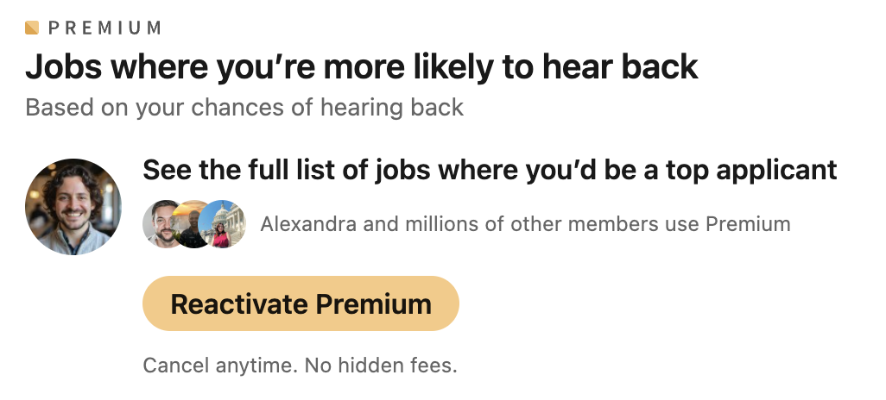

The job seeking experience can be a miserable existence. As an applicant, you try to hunt down unique postings that align with your experience and interests. But as you continue to send out more and more applications, you keep hitting walls.

Outdated listings.
No responses.

I've recently realized that most job seekers don't realize that the typical job boards aren't incentivized to really help them find a job. The current state reminds me of the argument against dating apps. Dating apps make their money by people subscribing to their service.

The thing is, most job boards don't care if you actually get placed in a job. They only care if they get web traffic so they can convince employers to pay to list said job on their website.

## Understanding the ATS
You see, when most companies have a job that they want to hire for, they list it on their Applicant Tracking System (ATS). Common examples of ATS include Greenhouse, Lever, Ashby, or Workday. At their core these systems are designed to allow companies to:
- Create and post job descriptions on an owned website portal.
- Allow candidates to apply to the jobs.
- Allow recruiters to facilitate interviews and communication with the candidate 
- Sync their job descriptions to external job boards (for free or for a cost)

In many ways, ATS are just like Customer Relationship Management (CRM) systems like Hubspot and Salesforce, just specifically designed for jobs. 
- You can track your leads (applicants) that demonstrated their interest in your offering (job)
- You can associate people to one or more ongoing deals (jobs).
- You can associate each applicant to a stage of the deal pipeline (Applied, Screened, Interviewed, Offered, Accepted)
- Throughout the entire process, you can associate communication, recordings, and files with your applicants.

It's important to understand the ATS because this is the central way that employers manage their jobs. 

## Why do companies use job boards?

From the perspective of a company, your goal is to try and fill a new job as quickly as possible. The job is your product and you need to market it to the right people at the right time. Sure, some people might care enough about your company to visit your careers page. But how often will they come back and check?[^1]

Enter job boards.

Most employers go straight to the big job boards. They want as wide of a reach as possible.

There's a lucrative market for niche job boards out there. Jobs for creative writers. Jobs for digital nomads. Jobs for fractional roles. Jobs for startups.

## Common Problems with Job Boards

Let's establish some general concepts first and then see how these play out with very specific examples of job boards.

### Most job boards charge to list jobs on their website.
There are two prevailing models to list your jobs. 
- Pay a flat fee to showcase your job for a set period of time
- Pay a small fee every time someone clicks the apply button on the job

Employers don't have infinite budgets for the jobs they need to fill. Instead, they're forced to prioritize which roles matter most to the business and spend to advertise these roles far and wide. As a result, most job boards will always be showing a limited subset of the possible jobs on the market.

### Job boards default to sort by most recent jobs first
When you first post your job, you show up at the top of the list. The number of eyeballs you have access to is incredible! But over time, your job posting starts slipping down the rankings, all the way to page 10+. Who will ever see it at that rate? And if someone sees that your job was posted weeks or months ago, will they actually believe it's still active?

As a result, many employers are incentivized to take down the job temporarily and repost it every few weeks. This shoots their job back to the top of the rankings list.

### Job boards don't always sync with an ATS
This issue causes two potential problems.
1. When an applicant applies to the job, the applicant lives in the job board's system, not the ATS. This requires someone to manually check these job board websites. 
2. The job being listed may no longer exist. There's a non-zero chance that the job has already been filled but the employer forgot to remove the job listing from the external job board.

The best job boards will link you directly to the ATS-backed careers page to apply. I honestly wouldn't trust anything else.

## Major Examples

### Indeed

### ZipRecruiter

### LinkedIn
In my opinion, LinkedIn is the worst offender.

For one, LinkedIn makes money from both sides of the marketplace.
- They try to charge job seekers for a premium subscription to gain the ability to see all relevant job matches.

- They charge employers for each job listing past the first one. These jobs are run as ads with daily and total budgets, targeted to very specific user profiles. To get a substantial amount of applicants as a small startup, I found that these would typically cost $30-50 per day.[^3]

## Niche Examples

Wellfound - 

RemoteJobs - Run by Peter Levels

Dice -

BuiltIn - 

## The Outliers

However, there's a new wave of job boards that are bucking the trend of the existing monetization model. Instead of waiting for employers to come to them, they source jobs directly from the employer's ATS. As a result, they have a more complete listing of jobs from the employer.

Ghostless - 

TrueUp - 

Remote Rocketplace - 

---
[^1]: I'm always surprised that more employers don't have an email subscription service for relevant jobs. Do most people not care enough about specific employers to know when their favorite companies open up relevant jobs? 
[^2]: There's a reason that the prevailing opinion online is to always go directly to an employer's careers page when applying to a job. If you want to have the highest guarantee that the job still exists and that someone will look at your resume, you want to go to their ATS-backed careers page.
[^3]: My personal anecdata from running job ads on LinkedIn is that they flood you with 100+ applicants in the first 24 hours that you pay them. This dopamine hit makes you feel like LinkedIn is amazing for finding applicants! However, the quality of the applicants is usually not as high and 