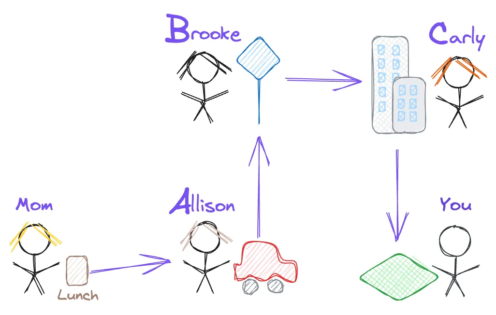

Whenever I travel to new cities, I always make it a point to take public transit if possible. For one thing, it’s generally the cheapest option. For another, it makes me feel a bit more like a local. I’ve been lucky enough to go to some places that I would consider to have excellent transit (Stockholm, Sydney, London) and even spots in the US where I thought it was pretty good (New Orleans, New York).

Last fall, I revisited my hometown of Fort Worth. After living there for over 20 years, I realized that I had never really explored it the way I would any other city. The Dallas-Fort Worth (DFW) Metroplex is extremely car-centric and as a result, even my adventures as a foreigner were limited to rides from Uber and Lyft.

To feel more like I was visiting the city for the first time, I made it my mission to get everywhere by public transit for the duration of my trip. My journey was memorable, but not in the way I had hoped. Instead, it gave me a new perspective on how much public transportation can suck and how eerily similar that is to the way so many people manage their data.

## Two Peas in a Pod

Let’s get the basic premise out of the way first. How are public transit and data pipelines similar?

**Public transit** is designed to move people from point A to point B through a series of inter-connected transportation methods, such as buses, trains, and ferries. The goal is to get people to their destination as quickly as possible while minimizing downtime due to delays or cancellations.

**Data pipelines** are designed to move data from point A to point B through a series of tools and scripts. The goal is to get data to its destination as quick as possible, without errors.

The problem with both of these systems is that things inevitably go wrong, so how do we go about making the experience as smooth as possible? [^1]

## My Transit Experience

Let’s start with a story.

For those of you who take public transit all the time, these notes may not come as a surprise to you. For someone like me who was born and raised in car culture, I’ve only experienced (and enjoyed) public transportation in major cities.

With Google Maps as my guide, I was able to plan out every route I needed to take and every transfer I’d need to make. The only problem was that Google planned for the ideal state of transportation, not for the reality of what it took to transport myself across town.

### No Stops

My first attempt was getting on the bus at 9:00am on a Sunday. I found the bus station and plopped myself onto the bench. It looked like 3 different buses would come by this station, but the one I was looking for was the all red electric bus called “The Dash”. That should be fairly easy to identify…

…and within minutes, the bus had driven by without stopping. Admittedly, that was probably my fault. My face shouldn’t have been buried in my phone while I was waiting. I just (wrongly) assumed the buses would make a stop as long as a person was sitting there.

I changed my demeanor to be on high alert to make sure I could flag down the next bright red bus I saw. When that finally occurred and I hopped on the bus, I immediately realized why I was initially sped by.

I was the only person on the bus.

With such limited ridership, it’s no wonder that the bus drivers would not stop unless flagged down.

### No Shows

Towards the afternoon, I rushed to the nearest bus stop to try and make the next bus. As I stood there and time kept ticking by, I kept instinctively unlocking my phone to make sure I got the time right.

“It said 1:05, right? It’s 1:06 and I still haven’t seen the bus.”

“Well now it’s 1:08. Is it just late?”

“It’s 1:10 - surely it wouldn’t be more than 5 minutes behi…. Oh wait. Now it just shows the next bus.”

It turns out that the bus just never showed up. My new options were to either: (a) continue baking in the sun on the side of the road for another 15 minutes, in hopes that the next bus actually showed up, (b) start walking to my destination.

### Zero Visibility

You’d think that using the mobile app would help, right? It would, if it actually showed the live travel information for each bus.

Part of the problem with no shows was that some of the buses showed “On Time”, some just showed “Scheduled”, and a total of zero showed the live status of the vehicles I was waiting on. The status of every bus just became a guessing game.

This lack of visibility extended to the bus itself. Even once I was on the bus, there was no indication of my current location and what stops were upcoming. It was my personal responsibility to know where the future stops were and when to pull the cord. Otherwise, I would be stuck on the bus making loops ad infinitum.

### Incorrect Visibility

On the note of visibility, I’m not sure what’s worse; feeling like you’re in the dark about transportation status or feeling like you you can’t trust the information being shown to you.

That evening as I wrapped up dinner, I ran into another instance of a bus not showing up when it was supposed to.

Dejected, I checked out my route to see if I should just wait it out or make alternative plans.

But wait! There was another bus station a block over that I could go to where the bus left in 3 minutes. Different route, similar destination? Don’t mind if I do.

I quickly picked up my things and fast-walked to the next bus station. I opened the app to get my ticket ready and… oh no. While Google tells me the route is valid, the transit app tells me that the route is actually canceled.

Dejected yet again, I reside myself to just walk back to the hotel. It’s a 30-minute walk and it’s getting late, but walking was still faster than waiting around another 15-30 minutes for a chance of nabbing a bus. I had been deceived one too many times in my single-day adventure to leave that one up to chance.

Then, not 5 minutes into my walking journey, I see the bus that was supposed to be canceled speed by. Miffed by misinformation, with no desire to run and flag down my ride, I decided to just keep going by foot on my slow but sure transportation method.

### Missed Connections
Trips that took me from A → B generally weren’t that bad. However, that wasn’t most of my trips.

Most trips involved a pattern of Walk → Bus → Walk → Bus → Walk. If my first bus was early, that was perfectly fine - I just have to stand around longer and wait for the next bus. If my first bus was late, my entire trip was thrown into disarray.

That’s primarily because every bus ran on different schedules. Some run every 15 minutes, every 30 minutes, and once an hour. With inconsistency in timing, any small deviation threw a wrench into my transportation plans.

### Abnormally Long Transit Times

On my final day of travel, I had to get to an office in Dallas from downtown Fort Worth. Normally, this would have been a car ride of 45 minutes, but my entire journey took more than twice that, totaling 1 hour and 45 minutes.

- At 7:15, I left my hotel to walk to the train station.
- At 7:30, the train arrived.
- At 8:25, I arrived at a station in downtown Dallas, 10 minutes later than the expected arrival. As a result, I missed my first bus and had to find an alternative route.
- At 8:35, I arrived at the new bus station.
- At 8:50, the bus finally arrived, 10 minutes late.
- At 9:00, I finally arrived at my expected location.

All of the problems listed above culminated in a slow, frustrating transportation experience.

### The Verdict
In a three day span, I encountered almost every possible problem you possibly could when taking public transportation. What I listed out doesn’t even cover the entirety of the experience[^2]. This leads me to believe that these weren’t one-off issues. This was endemic to the system. And boy do I feel sorry for the people that have to rely on the region’s public transportation every day.

## The Data Pipeline Reality
So how does this all relate to your data pipelines?

For public transit to be trusted, it requires for it to be consistent, observable, and reliable. As soon as any one of these factors breaks down, your journey becomes a frustrating mess. The same truths apply to your data pipelines.

The benefit (and curse) of public transit is that a problem with the system ends up directly affecting you. To resolve the issue, you can personally take action to ensure that you reach your final destination.

The same can’t be said for your data pipelines. Data has no agency. It just follows a series of instructions and goes where it’s told to. If a specific transportation method runs into issues, your data either isn’t going to be reaching its destination or it’ll be reaching the destination in an incomplete form.

The other issue with data pipelines is that there is a handoff of goods between every step, instead of transporting one item (yourself).

### The Handoff of Goods

Take yourself back to your school days. Imagine you were going on a field trip, but you forgot to pack your standard lunch - a sandwich, an apple, and chips[^3]. Fortunately, your mom realized it, but she couldn’t bring the lunch directly to you. Instead, she called up her friends to try and find a way to make sure it got safely into your hands.

After making your lunch, she called up **A**llison to swing by the house and drive your lunch to a bus stop and set it there. She knew that **B**rooke took the bus to work and would go by that stop, so she could pick it up and take it to her office. Her friend **C**arly worked for USPS and always delivered mail to Brooke’s office, so she could pick the lunch up and take it to your teachers at the field trip location along the route. The end result - you got your lunch!

_The absurd, over-trusting reality of most data pipelines_

Now let's imagine the scenario where your mom had to do this every day to get your lunch delivered. Do you think you’d get your lunch every day? Or would it be absolute chaos?

- What would happen if your mom ran out of bread and had to run by the grocery store first?
- What would happen if **A**llison’s car broke down and she couldn’t pick up the lunch initially?
- What would happen if **B**rooke was running late for work and missed the normal bus?
- What would happen if **C**arly didn’t have to make deliveries to Brooke’s office that day?

Even if every person did their job 100% right, they would still have no context into the contents of the lunch, so the lunch itself could have problems.

- What would happen if your mom accidentally used moldy bread?
- What if the lunchbox was partially unzipped and the ice packs fell out?
- What if someone at the office thought the apple looked good and ate it?
- What if someone’s daughter had the same lunchbox as you and they accidentally swapped them?

It’s really easy to identify the gaps in an absurd situation like this. You wouldn’t ever deliver a kid’s lunch via a convoluted network of handoffs. There’s too many things that could go wrong.

So why do we submit ourselves to this absurdity when delivering data?

- Data engineers set up the initial data, but they don’t end up using it themselves.
- Analytics engineers set up quality tables and views to access the data, but they too don't use the data themselves. 
- Nobody on the BI team checks the marketing data for their dashboards—they just build them.
- Data analysts use the dashboards, but they don’t know how the data gets delivered behind the scenes.

In each of these situations, members of the data team aren’t aware of the context of how data gets used because they feel like it doesn’t affect them. This is the normal (but totally wrong) approach for managing data pipelines.

**A smooth running data pipeline is the responsibility of every member of the data team.** Everyone needs to know where the data is coming from, where it’s going, how it’s being used, who is the end user of that data is, and what the business impact is of that data usage. Every handoff between stages and tools should be fully connected and visible.

## Addressing Pipeline Transits

So back to the public transit situation. How do each of the issues I faced in my journey relate to the problems you face with your data pipelines? And how do you resolve them?

At the simplest level, when building your data pipelines, you need to put yourself in the shoes of your data. Imagine you’re the one being transported from location to location. Are you building the optimal experience to make sure you’ll get from point A to point B successfully 100% of the time? A data pipeline has to feel more like a concierge service designed specifically to move your most important passenger, the data, as quickly and consistently as possible.

Let's walk through each of the problems I faced and how they related to your data pipelines:

### No Stops
Sometimes, teams build systems where a single running script can be responsible for extracting, transforming, and loading the data. This setup gives you a “no stops” problem. Your team knows the system is running and you know where the data is going, but you never know exactly where the data is at on its journey.

If something breaks, it’s difficult to know exactly where the data stopped. At the sign of any issue, you have to sit around and wait for the entire process to run again.

If you want to avoid the issue of “no stops”, you need to break your data process into chunks of work being performed. Every new location your data moves through should be a separate script or job. This has two benefits:

- If something breaks, you’ll know exactly what chunk of work needs to be re-run.
- Everyone on the team can see “under the hood” into what work ultimately generates the data that they use. They can easily connect their own process to any of these steps so if something breaks, their own process can “pump the brakes” until the data arrives successfully.

### No Shows
Sometimes, data just doesn’t show up when you expect it to.

During a busy workday, you might be waiting on a crucial update to complete your analysis. You keep refreshing your dashboards, but your expected data never arrives. A glitch in the pipeline had caused a "no show" of the vital information you need.

You can choose to wait indefinitely for the issue to be resolved or to manually dig into the pipeline and figure out what went wrong.

Just like my experience at the bus stop, business stakeholders grapple with the uncertainty of whether or not their anticipated data will ever materialize or if they’ll be left with incomplete analysis, missing the insights they desperately need. They’ve been scarred one too many times, so they choose to take matters into their own hands by pulling reports manually.

### No Visibility
Major issues can arise when you can't distinguish between tasks that are actively processing, those that have already finished, and those that are merely queued. Just like waiting for a bus with an unclear status, you find yourself guessing when, or if, the data will arrive at its intended destination.

This lack of visibility isn't just frustrating; it's an obstacle to efficient data management. It's as if you're on a journey without a map, unaware of your current position. Without visibility, it becomes your responsibility to stay vigilant, track the pipeline's progress, and intervene when necessary.

The most important part to address is knowing the status of your data pipelines at any moment. Anyone in your organization should always be able to look up exactly where your pipelines are at in their process and what dashboards, scripts, and models are impacted by those pipelines. Otherwise, you risk forcing everyone into a guessing game of where their data is at and when it will finally arrive.

In general, I advise people to address this problem through "proactive alerting". Every step of your data pipeline should have appropriate error handling to automatically:

- Notify stakeholders of downstream data products that will be effected (with bonus points for including an expected resolution time)
- Notify relevant data team members who can resolve the issue
- Create and assign bug tickets in your project management system

This is the easiest way to increase trust in your data pipelines outside of providing a visible dashboard for pipeline status and connections.

### Incorrect Visibility
What’s even worse than not knowing where your data stands is getting the wrong information. Maybe stakeholders think that data is updated when it’s not, making internal reports that get shared with the executive team using outdated data.

Or maybe business users sit around waiting for the data to load, growing increasingly frustrated, despite the data already loading 3 hours ago.

Whatever the situation, it’s important to make sure the visibility of your data process is 100% accurate to build trust within the organization. Business users need to be able to trust the data, but verify the status of the last update.

### Missed Connections & Long Transit Times
When you build your data pipelines with disparate tools and systems, you’re effectively trying to coordinate multiple modes of transportation for your data that run on separate schedules. The only problem? In the real world, buses run every 15 minutes. In the data world, your processes might only run once daily. If you miss the connection, tough luck. Your data won’t actually get delivered correctly today.

Data pipelines that process information in a straightforward, linear manner usually aren't too problematic. However, that's not the case for most pipelines.

Many data pipelines involve a series of interconnected stages, resembling a pattern like Extract → Transform → Load → Visualize → Action. If the initial extraction process finishes early, that's generally fine - you'll just have to wait a bit longer for the subsequent stages to catch up. However, if the extraction process is delayed, the entire pipeline can be thrown into disarray. The same issue can occur for any of the stages.

That's mainly because each stage in the pipeline operates on different timeframes. Some stages may be completed in minutes, while others can take hours or even days. With inconsistency in timing, any small deviation can throw a wrench into your data processing plans, making it challenging to deliver accurate and timely insights.

It’s important to make sure that your data pipelines aren’t missing any connections along the way. Extra care has to be taken to ensure that every destination is reached along the way.

## Avoid Failing The Passenger
The challenges faced during a suboptimal public transit experience can be surprisingly analogous to the difficulties encountered when managing data pipelines. Both carry the same risk of failing to deliver their respective passengers in a consistent, timely fashion. 

The solution isn't overly difficult - you just need to have the rigor and discipline to set things up correctly. Invest in robust monitoring tools, best practices, and well-designed data orchestration strategies. Think of solving these problems as soon as you start moving data between systems.

By learning from the pitfalls of public transit, we can better understand the need for efficient, transparent, and reliable data pipelines. In doing so, we can streamline the journey from raw data to valuable usage of that data, empowering businesses and individuals to make more informed decisions and drive growth in an increasingly data-driven world.

Start thinking about the transfer of your data like you would your own transportation across a city. Get just as frustrated for your data as you would get frustrated for yourself. Make your data pipelines an enjoyable transportation experience. Your organization will thank you in the end.

[^1]: An unexpected discovery while writing this article was the idea that you can either build your data pipeline to perform like the most perfect public transit (everything runs multiple times on fast schedules to eventually get the data where it’s going) or you can build your data pipeline to be like a custom limo service that caters to your data’s beck and call.    I’m still not sure which is the better option. I would love to hear your thoughts!

[^2]: Other issues I faced during my Fort Worth public transit journey:   - The fastest way to the Botanic Garden (a Fort Worth gem) was walking 15 minutes from a bus dropoff point. About 2/3 through that walk, I no longer had a sidewalk and had to walk in the grass alongside a busy road while avoiding mud. (In hindsight, I think this was wrong, but that’s what Google told me to do).   - I had to walk on the side of a highway access road with no sidewalk to get to the nearest bus station from the Botanic Garden.    - I had to drag a roller suitcase for a mile on the sidewalk in Dallas due to a lack of overlapping bus stations. I mean, I could have waited 30 minutes for the next bus to take me a mile, but then I would miss my Vonlane bus back home.   - Back in my hometown of Austin, the Google recommendation was to take a bus to the nearest bus station and grab a Lyft because it was 1h 15m faster.

[^3]: Sadly, I don’t have to go back to my childhood days for this one. I still each a sandwich, apple/banana, chips, and nuts for lunch every single day. Old habits die hard.