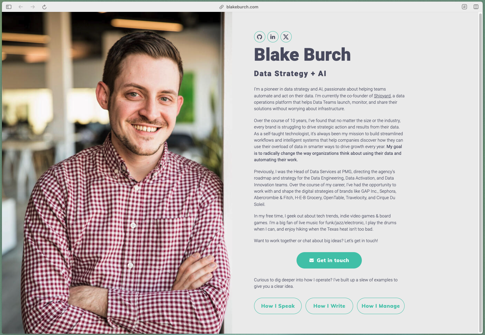
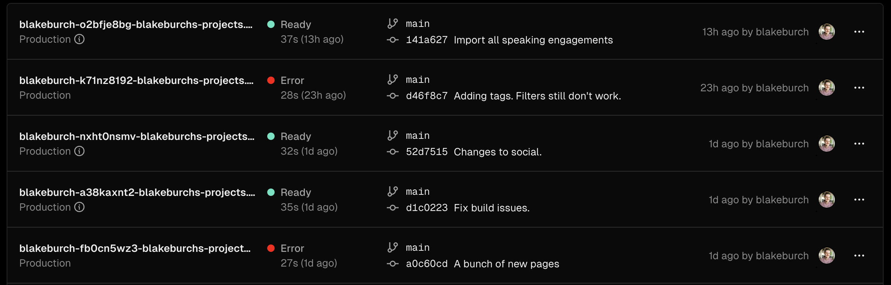

## Tech Used
- [Astro](https://astro.build/)
- [Cursor](https://cursor.sh/)
- [Cloudflare Pages](https://pages.cloudflare.com/)

## Story
At first glance, this website is nothing special. It's a simple, static site. But it's a big deal to me. It's the first website I've ever built and deployed.

I've had a one-page website on carrd.co for years. It was ugly. It was inflexible. It was everything crammed on one page. And now, it's no more.

Initially I was on the hunt for a superior blogging platform. I wanted something that would allow me to quickly publish my thoughts and ideas using markdown. I wanted something that would get out of the way and make it easy for me to publish off-the-cuff thoughts.

I had the great fortunate of coming across [this post](https://news.ycombinator.com/item?id=41014806) on Hacker News. A list of ways people currently run their blogs.

Through the discovery phase, I realized that what I really needed was more than a blog. I didn't want to have a main site that just linked out to a bunch of other different sites. I wanted to have a mix of personal thoughts, long-form takes, projects, and "second brain" items. I wanted control over the SEO. I wanted the flexibility to change how I structured my thoughts over time, since I'm still arguing with myself about the difference between a blog, a note, and a conceptual thought.

I realized that what I really needed a flexible platform that could be extended, all while giving me full ownership over the content.

I took this website as an opportunity to learn three new things:
- How to build with a static site generator (SSG) framework (Astro)
- How to deploy a static site (Cloudflare Pages)
- How to build with a new AI IDE (Cursor + Claude Sonnet 3.5)

## Development Process
I first explored Astro themes until I found something that I really liked, [Astro Micro](https://astro.build/themes/details/astro-micro). It kept things pretty simple visually, focusing more on the text content than anything else. It also included automatic sitemaps, RSS feeds, and comments.

I cloned this repository and got to work with Cursor (my first time every using it). After going through the first session of Sahil Lavingia's [Coding with Cursor](https://sahil.gumroad.com/l/coding-with-cursor) course, I felt ready to hit the ground running. I had a few changes I needed to make to get the website where I wanted it.

Throughout this entire process, I wrote very little code. Cursor really made me feel like a project manager. I was able to describe exactly what I wanted and Cursor would generate the code. I just had to click into the right files, click apply, then accept the changes. [^1]

[^1]: This was still very annoying. For one, I couldn't create and edit multiple files at a time. Also, I had to manually browse the file structure because it would generate some code, but not give me the exact file that needed to be edited. I honestly wish the process was simpler. If I say "Looks good!" it just implements the changes everywhere.

### Speaking Engagements

#### Adding A New Content Type
I knew that I wanted an entire section of the website dedicated to my speaking engagements. Over the past few years, I've spent more time trying to share my perspectives at conferences and on podcasts. I originally started collecting these speaking engagements in [Airtable](https://airtable.com/app9SgTBgOaXlnvaw/shr5aKrlblKGse10A/tblcKCZwZwbVGTKw6). The problem was that this wasn't very accessible (and IMO looks terrible being embedded).

To add the new content type, I just needed to:
- Add a new folder under `src/pages/speaking` to include files that indicated how I wanted the main page to display and how I wanted individual speaking engagements to display.
- Add a new folder under `src/content/speaking` to include individual speaking engagements.

#### Creating Speaking Engagement Content
Initially, I was frustrated with the requirement to add a new folder with the slug title with a file named `index.md` for each new speaking engagement. This layout had a few drawbacks in my mind:
- My folder names were too long. Do I really want folder names like `techtastic-from-data-chaos-to-clarity-unraveling-data-engineering-with-blake-burch`?
- I couldn't tell all of the files apart in my editor. There were far too many `index.md` files in my tabs.

After a bit of experimentation, I learned two new things that made this process much easier:
- I could include a `slug` field in the frontmatter of the markdown file, allowing me to use a more human-readable name in the folder structure.
- I could eliminate the folder structure entirely, dumping a bunch of named markdown files into the `src/content/speaking` folder, and it would work exactly the same.[^2]

[^2]: As I understand it, the benefit of the folder structure is that it allows you to collect referenced files in a single spot. If I ever decide to embed the audio or video files, I may decide to change the structure. But for now, I'm happy with the simplicity.

Fortunately, since I had a list of all of my speaking engagements in Airtable, I was able to easily export that data to a CSV file and turn each row into a separate markdown file. I quickly learned that both Cursor and Claude won't create new files for you, so I had to turn to old faithful (ChatGPT) to turn my list of speaking engagements into a zipped folder of correctly formatted markdown files. Once I had the files, I dragged them into the `src/content/speaking` folder, cleaned up a few issues, and was ready to move on.

### Tagging my Posts

#### Creating Tags
For starters, I wanted all posts to have tags. That seemed like an ideal feature, so I described my needs to Cursor.
- Any post could have multiple tags.
- I would need to define colors for specific tag labels. Anything else would give a nice grey. 
- Tags would need to look good on both dark mode and light mode.
- Tags needed to be displayed prominently on both the posts and the cards that highlight the posts.

This involved updating the `/src/content/config.ts` to include a new variable of `tags: z.array(z.string()).optional(),`. Then, I could add a new field to the frontmatter of every post to include `tags: ["tag1", "tag2"]`.

#### Displaying Tags
Displaying the tags was relatively easy. I just asked Cursor to create the new tag component. It separated out the logic of the tag component from the color logic to create the visuals. Then I instructed it all the pages that I wanted it to be added to:
- Every piece of content via the `[...slug].astro` pages
- The ArrowCard component that displays the content on the home page and on the collection pages.

#### Filtering
What's the point of having tags if you can't let people filter by them? I wanted each section of the website to have tags at the top that you could filter by.

Initially, I was given an option that showed checkboxes next to every possible tag label. I simplified it a bit to just show the tag label itself, making that clickable with a "highlight" effect to indicate that it was selected.

This ended up being a bit more complicated than I thought. You see, by having on page filtering, I needed to have a lot of custom logic that listening for on page events and updated the UI based on the current filter. Sometimes it would work when I refreshed the page. Sometimes clicking a filter would clear the entire page. Sometimes after clicking between pages, clicking a filter would do nothing.

I got myself into a loop for trying to get it to work. One fix led to more bugs. That fix led to even more bugs. Eventually we returned to the "genesis bug" and I gave up. I probably spent 2 hours going back and forth with the AI trying to get it to work. This was the first time that Cursor failed me.

In reality, it would probably help if I knew a bit more about how Astro works and how javascript in general works. Now, you can see below that it's a TODO item. One day I'll finally implement it.

### Including Social Links in the Footer
The original Astro Micro theme included a section on the home page with text links to social media profiles. Instead, I wanted to icons on the footer so that someone could find it no matter what page they were on.

This part impressed me the most. My links were set as environment variables in the `consts.ts` file. I asked it to create SVG icon buttons that were centered in the footer, linking to the values stored in the `consts.ts` file. Cursor was able to read the values understand the context of the links, and generate fresh SVG icons that matched the existing style of the light/dark buttons. The only thing I had to change was the icon from Twitter to X, which only took one prompt to fix.

### Consistent External Links
I really like when sites give me an indication that the link I'm going to click is external or not. So, I described the functionality to Cursor and it built a script I could embed that checks if the link is external or not. If so, it would add an icon to the end of the link.

I think that's a pretty inefficient way to go about it, but given that the site is fairly basic with text, I don't foresee it being a problem.

### Relying on Markdown for Extra Pages
I knew that I wanted to have an "[About](about/)" page, a "[Now](now/)" page, and to finally transfer my [README](readme/) page from Google Docs to the website. However, I didn't want to have to format everything in HTML like the home page. I wanted to be able to write these pages Markdown.

It turns out, that process wasn't too difficult. I had Cursor build me a new layout component that I called `src/layouts/WallofText.astro`. I could then use that layout in any of my markdown files by referencing `layout: ../layouts/WallofText.astro` in the frontmatter. Then, all I had to do was write.

### Misc
I'm sure there were a few other things along the way, like updating the header to include new pages, and updating the home page to include a new section for media engagements. But I think I've covered the most important ones.

## Deployment Process

About halfway through the development process, I switched tasks to figure out how to get this thing live on the web. From past exposure, I knew that I would likely end up trying both Vercel and Cloudflare Pages.

Honestly, both were extremely easy to set up. The ability to simply connect to a GitHub repo and have it automatically deploy on every commit to the main branch took less than 5 minutes. What an exceptionally refined onboarding experience!

In an effort to move fast, I kept committing all of my changes in the development process to the main branch. However, that bit me a few times. I kept forgetting to run `yarn build` before committing to ensure that the website could be built without errors. That meant that I kept making commits that resulted in failed deployments.

I ultimately went with Cloudflare Pages because I've read a few [too](https://news.ycombinator.com/item?id=39520776) [many](https://getconvoy.io/blog/stripe-webhook-delivery-failure) [horror](https://twitter.com/zemotion/status/1798558292681343039) [stories](https://twitter.com/shoeboxdnb/status/1643639119824801793) about DDOS attacks and rogue function calls resulting in huge bills.

## Final Product

Well, you're looking at it! The whole thing only took me 2.5 days to initially get up and running, seeded with some bare bones content. I now have a fully functional website that I can use to share my thoughts, projects, and ideas with the world. Plus, I have full ownership so I can start building up credibility and a SEO presence on the web.

I'm sure this site will continue to evolve, but now I have full control on what the future looks like. I'm pretty excited to see where this goes!

Want to know more about this process? Please reach out! I'd love to chat about it.

### TODO
No job is ever complete. Here are a few things I'd like to add in the future, in no particular order:

- [ ] Build a good downloader/transcriber for podcasts and videos so I can add transcripts to all speaking engagements.[^4] 
[^4]:Given that Shipyard's most popular videos related to transcribing YouTube videos (10k and 5k views with <500 subscribers at the time), I think there's a larger product opportunity here.

- [ ] Add tag filtering to each collection section (blog, projects, speaking engagements)

- [ ] Incorporating an email platform to collect emails and automatically send a message to subscribers when a new article is posted, based on their preferences. I kinda want to roll my own system with [Resend](https://resend.com), [SendGrid](https://sendgrid.com/en-us), or AWS SES. RSS to Email was always more difficult and expensive than I thought it should be.

- [ ] Add a CI/CD process using Github Actions to ensure the website can be built without errors. If so, automatically merge the PR.[^3]
[^3]: I have yet to build with GitHub Actions, so I'm excited to explore this concept.

- [ ] Hook up Obsidian to this repository so I can easily continue writing drafts in Obsidian but have the end result get published to the web. It strikes me as odd to commit a post to a public repository listed as "draft".

- [ ] Add some form of privacy-focused analytics like [Fathom](https://www.usefathom.com) to the site so I can see what people are engaging with.

- [ ] Introduce a section for [Quartz](https://quartz.jzhao.xyz/) so I can publish Obsidian notes publicly as a second brain.

- [ ] On larger screens, make the table of contents display on the side and be sticky. I LOVE the look of a table of contents that is omnipresent and shows you where you're at in the context of where you've scrolled to.

## What I Learned
Beyond the basics of "learning new tools", I learned a few things:
- Footnote numbers in markdown don't actually matter. Everything can be `[^1]` and it'll get converted to the right number whenever you publish.
- Claude 3.5 still can't run code. It's weird, because it *writes* much better code than GPT-4 models, but it can't directly execute that code and do the job for you.
- Coding with a new technology using AI still helps you learn the new technology. I don't claim to know how the `.astro` file format works, but I understand the basic file structure that results in the final pages getting generated. That's something.